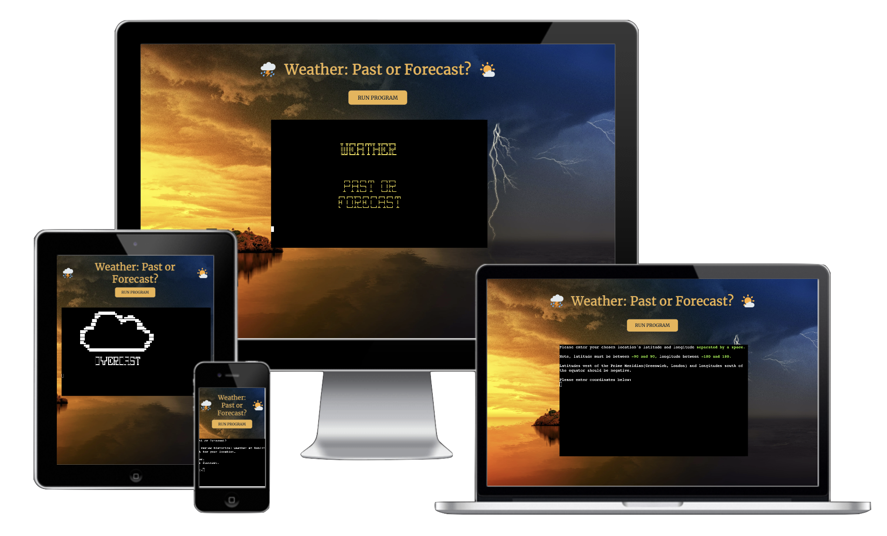

#  Weather: Past or Forecast?

Weather: Past or Forecast is a command line application that allows the user to check past weather or get a weather forecast directly from the terminal.

This application is showcasing Python coding for Project Portfolio 3 and can be accessed by following this [link.] **ADD LINK



## Contents
<a name="contents"></a>

- [UX](#ux)
  - [Strategy](#strategy)
    - [User Stories](#user-stories)
  - [Scope](#scope)
    - [Essential Content](#essential-content)
    - [Optional Content](#optional-content)
  - [Structure](#structure)
  - [Skeleton](#structure)
    - [Wireframes](#wireframes)
  - [Surface(Design)](#surface-design)
    - [Colour Scheme](#colour-scheme)
    - [Imagery](#imagery)
    - [Logo](#logo)
    - [Typography](#typography)
- [Features](#features)
  - [Existing Features](#existing-features)
  - [Features Left to Implement](#features-left-to-implement)
- [Technologies Used](#technologies-used)
  - [Languages Used](#languages-used)
  - [Frameworks, Libraries & Programs Used](#frameworks-libraries--programs-used)
- [Testing](#testing)
  - [Development Testing](#development-testing)
  - [Testing User Stories](#testing-user-stories)
     - [Adult User Goals](#adult-user-goals)
     - [Child User Goals](#child-user-goals)
     - [Site Administrator Goals](#site-administrator-goals)
  - [Responsiveness Testing](#responsiveness-testing)
    - [Physical Device](#physical-device)
    - [Simulated Devices](#simulated-devices)
  - [Browser Compatability](#browser-compatability)
  - [Validator Testing](#validator-testing)
  - [Bugs / Issues](#bugs--issues)
  - [Unresolved Bugs / Issues](#unresolved-bugs-or-issues)
- [Deployment](#deployment)
  - [Git Hub Pages](#github-pages)
  - [Forking the GitHub Repository](#forking-the-github-repository)
  - [Making a Local Clone](#making-a-local-clone)
- [Credits](#credits)
  - [Content](#content)
  - [Media](#media)


## UX
### Strategy
The objective of the site is to allow users to review past weather for a location in Ireland or obtain a weather forecast for a geographic location using coordinates.
#### User Stories
- User Goals:
  - To access the historical weather for a selected date at Dublin airport.
  - To access a 3 day weather forecast for a given location.
  - To be able to leave feedback on the app.
<br><br>
- Site Administrator Goals:
  - To give users the options to access historical weather, weather forecasts and have the option to create, read, update and delete feedback.
  - To create an application using Python with clean, resuable and commented code, utilising atomic functionality and OOP where appropriate.
  - To handle any potential errors appropriately.
  - To maintain secrecy of API key for weather data provider.

### Scope
#### Essential Content
 - The app will allow users to enter a date and receive the weather for that given day.
 - The app will allow users to enter latitude and longitude coordinates to obtain a weather forecast for that location. <br><br>
#### Optional Content
- A feedback option where users can leave their feedback on the app.<br><br>
### Structure
 - **ADD
### Skeleton
#### Wireframes
- **ADD
### Surface (Design)
#### Colour Scheme

- **ADD
#### Imagery
- The background image was sourced from [Pexels](https://www.pexels.com/) and was selected for exhibiting a number of different weather types in one image.

- **ADD.<br><br>
#### Logo

- **ADD
#### Typography
- **ADD

<a href="#contents">BACK TO CONTENTS 🔼</a>

## Features 

### Existing Features

- __Starting Options__ <br><br>


  - **ADD<br><br>
- __Past Weather__ <br><br>
 

  - **ADD<br><br>
- __Weather Forecast__ <br><br>


    - **ADD
- __Feedback__ <br><br>


  - **ADD<br><br>

### Features Left to Implement
- **ADD

<a href="#contents">BACK TO CONTENTS 🔼</a>

## Technologies Used

### Languages Used
- Python: used extensively during project.
- Markdown: Used exclusively for README.
- HTML5: minor use when applying styling to app view.
- CSS3:minor use when applying styling to app view.<br>

### Frameworks, Libraries & Programs Used
- gspread: used to complete CRUD actions on Google Sheets.
- termcolor: used to apply foreground and background colors to terminal text.
- datetime: from the standard library, used to perform operations on date and time objects and strings.
- numpy: used to create a range of floats due to python range only returning a range of integers.
- itertools: from standard library used to iterate over list for loading animation.
- pyowm: library with classes used to manage Open Weather API calls.
- time: from the standard library used to access sleep method for pauses during pertinent points of relaying information to the user.
- os: from the standard library used to access system method to clear terminal screen at appropriate points whilst the program is running.
<br><a href="#contents">BACK TO CONTENTS 🔼</a>
## Testing 
### Development Testing

- __Starting Options__
  - **ADD  <br><br>
- __Past Weather__
  - **ADD <br><br>
- __Weather Forecast__
  - **ADD.<br><br>
- __Feedback__
  - **ADD.<br><br>

### Testing User Stories
**ADD
#### User Goals
- **ADD**
  - **ADD

#### Site Administrator Goals
  - **ADD.**
    - **ADD

### Validator Testing 

- HTML
  - No errors were returned for the page when passing through the official W3C HTML validator:
    <br><br> **ADD
    
- CSS
  - No errors were returned for the page when passing through the official W3C CSS validator:
    <br><br> **ADD

- Python
  - **ADD.
  <br><br> **ADD

- Accessibility
  - Accessibility of the page was checked using the lighthouse tool in devtools. The results were satisfactory for both desktop and mobile as shown below. **ADD
     - Desktop results:
     
     - Mobile results:
     
<br><br>
  - The colour contrasts **ADD.<br><br>
  
  <table  width = 100% cellspacing="0" cellpadding="0">
  <tr>
  <td></td>
  <td> </td>
  </tr>
  </table>

 
<a href="#contents">BACK TO CONTENTS 🔼</a>
### Bugs / Issues
**ADD
<table  width = 100% cellspacing="0" cellpadding="0">
   <tr>
   <th>Issue/Bug</th>
   <th>Solution</th>
   </tr>
   <tr>
   <td>**ADD</td>
   <td>**ADD</td>
   </tr>
   <tr>
   <td>**ADD</td>
   <td>**ADD</td>
   </tr>
   <tr>
   <td>**ADD</td>
   <td>**ADD</td>
   </tr>
   <tr>
   <td>**ADD</td>
   <td>**ADD</td>
   </tr>
   <tr>
   <td>**ADD</td>
   <td>**ADD</td>
   </tr>
   <tr>
   <td>**ADD</td>
   <td>**ADD</td>
   </tr>
  </table>

### Unresolved Bugs or Issues
- **ADD. <br><br>
<a href="#contents">BACK TO CONTENTS 🔼</a>

## Deployment

### GitHub Pages
The site was deployed to GitHub pages. The steps to deploy are as follows: 
1. Log in to GitHub and locate the [GitHub Repository.](https://github.com/)
2. Under the repository name, click ⚙ Settings. If you cannot see the "Settings" tab, select the  dropdown menu, then click Settings.
3. In the "Code and automation" section of the sidebar, click  Pages
4. Under "Build and deployment", under "Branch", use the None or Branch dropdown menu and select a publishing source.
5. Once the master branch has been selected, the page will be automatically refreshed with a detailed ribbon display to indicate the successful deployment. 

The live link can be found [here.](https://johnamdickson.github.io/Portfolio-Project-2/index.html)

### Forking the GitHub Repository

By forking the GitHub Repository we make a copy of the original repository on our GitHub account to view and/or make changes without affecting the original repository by using the following steps:

1. Log in to GitHub and locate the [GitHub Repository.](https://github.com/johnamdickson/Portfolio-Project-2)
2. At the top of the Repository (not top of page) just above the "Settings" Button on the menu, locate the "Fork" Button.
3. You should now have a copy of the original repository in your GitHub account.

### Making a Local Clone

1. Log in to GitHub and locate the [GitHub Repository.](https://github.com/johnamdickson/Portfolio-Project-2)
2. Under the repository name, click "Clone or download".
3. To clone the repository using HTTPS, under "Clone with HTTPS", copy the link.
4. Open Git Bash
5. Change the current working directory to the location where you want the cloned directory to be made.
6. Type `git clone`, and then paste the URL you copied in Step 3.

```
$ git clone https://github.com/YOUR-USERNAME/YOUR-REPOSITORY
```

7. Press Enter. Your local clone will be created.

```
$ git clone https://github.com/YOUR-USERNAME/YOUR-REPOSITORY
> Cloning into `CI-Clone`...
> remote: Counting objects: 10, done.
> remote: Compressing objects: 100% (8/8), done.
> remove: Total 10 (delta 1), reused 10 (delta 1)
> Unpacking objects: 100% (10/10), done.
```

Click [Here](https://help.github.com/en/github/creating-cloning-and-archiving-repositories/cloning-a-repository#cloning-a-repository-to-github-desktop) to retrieve pictures for some of the buttons and more detailed explanations of the above process.<br><br>
<a href="#contents">BACK TO CONTENTS 🔼</a>
## Credits 
### Content 
NOTE: Specific links are included within the HTML, CSS or Javascript files. The list below summarises content credits in general.
- Stack Overflow, W3 Docs, MDN Web Docs and other online resources were a massive help for HTML, CSS or JS code that enabled some of the functionality I was looking for.
- Beafort scale used to describe weather from given wind speed. Source in [wikipedia.](https://en.wikipedia.org/wiki/Beaufort_scale)
- Cardinal and ordinal wind directions taken from [Windy](https://windy.app/blog/what-is-wind-direction.html).
- **ADD
### Media
- **ADD
<br><br>
<a href="#contents">BACK TO CONTENTS 🔼</a>
